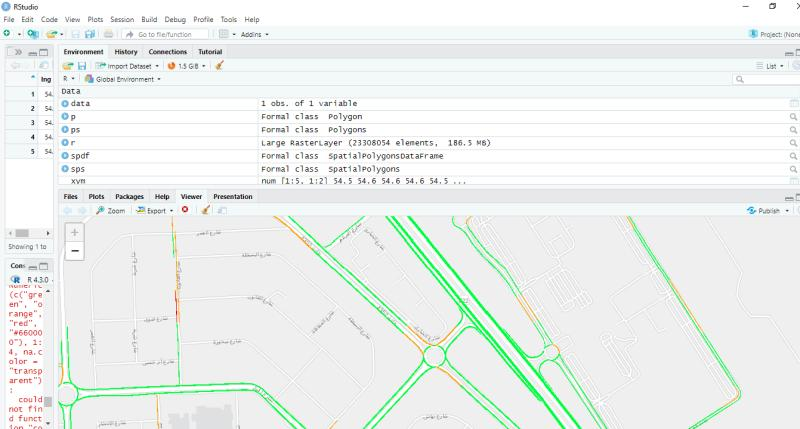
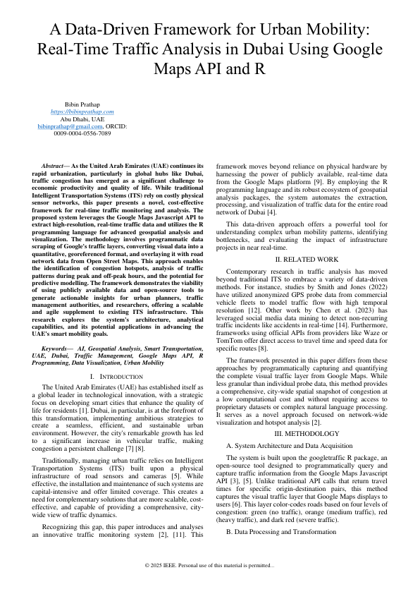
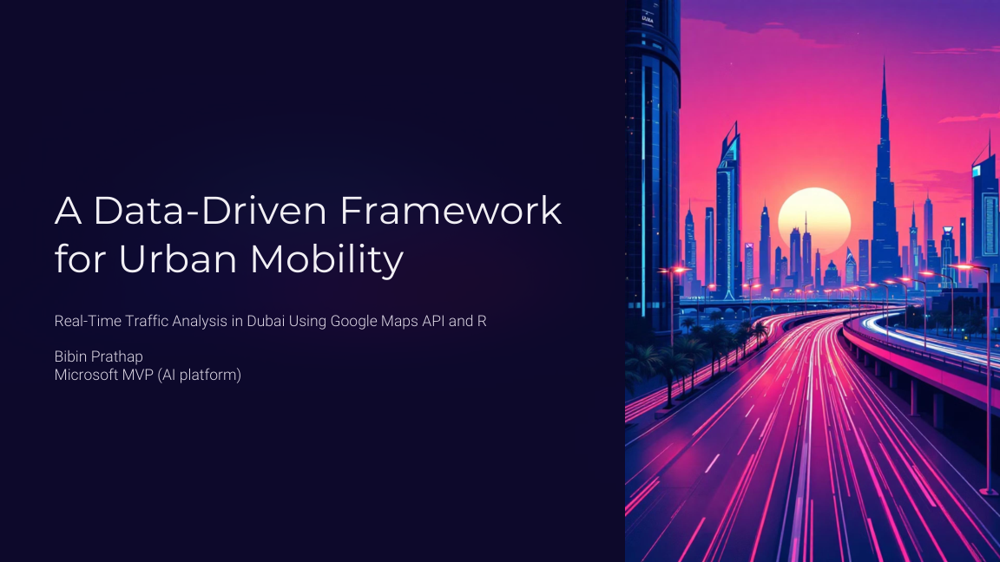

 
 # 🚦 Real-time Dubai Traffic Analysis using Google M 
    


[](https://github.com/bibinprathap/ai-google-traffic-analysis/stargazers)
[](https://opensource.org/licenses/MIT)
[](https://www.r-project.org/)
[](https://github.com/bibinprathap/ai-google-traffic-analysis/commits/main)

A powerful R-based solution for analyzing and visualizing real-time traffic conditions across Dubai using Google Maps API data.

## 🌟 Why Star This Repository?

- **First open-source** Dubai-specific traffic analysis tool
- **Real-time data** processing pipeline
- **Ready-to-deploy** API endpoints
- **MongoDB integration** for data persistence
- **Beautiful Leaflet visualizations**

```bash
# Quick install
git clone https://github.com/bibinprathap/ai-google-traffic-analysis.git
cd ai-google-traffic-analysis
Rscript -e "install.packages(c('googletraffic', 'leaflet', 'mongolite'))"


## 📊 Key Features

| Feature | Description |
|---------|-------------|
| **Real-time Data** | Live traffic data from Google Maps API |
| **Polygon Analysis** | Analyze specific Dubai neighborhoods |
| **API Endpoints** | Ready-to-use `/googletraffic` and `/googlePolygon` endpoints |
| **Data Storage** | MongoDB integration for historical analysis |
| **Visualization** | Interactive Leaflet maps with traffic heatmaps |
## 🚀 Getting Started

### Prerequisites
- R (≥ 4.3.0)
- Google Maps API key
- MongoDB instance

### Installation

```r
# Install required packages
install.packages(c("googletraffic", "leaflet", "mongolite", "plumber", "raster", "sp"))
```

### Configuration

Add your Google Maps API key to `config.R`:

```r
google_key <- "YOUR_ACTUAL_API_KEY"
```

Set up MongoDB connection in `db_config.R`:

```r
mongo_url <- "mongodb://localhost:27017/yourdb"
```
### 🗺️ Example: Analyzing Downtown Dubai

```r
source("googletraffic.R")

# Get traffic for Burj Khalifa area
r <- gt_make_raster(location = c(25.1972, 55.2744), 
                    height = 2000, 
                    width = 2000,
                    zoom = 16)
```
## 📈 Sample Output
 

## 🤝 Contributing
We welcome contributions! Please see our Contribution Guidelines.

## � Research & Publications

This project is part of a broader research initiative on urban mobility and smart city infrastructure. Access our full research findings here:

### 1. Dubai Traffic Analysis using Google Maps & R (IEEE 2025)
[](Prathap_2025_Dubai_Traffic_Analysis_Google_Maps_R_IEEE.pdf)
*   **[Read Full Paper (PDF)](Prathap_2025_Dubai_Traffic_Analysis_Google_Maps_R_IEEE.pdf)**
*   *Key contributions: Real-time spatial analysis, congestion indexing, and predictive modeling for Dubai traffic.*

### 2. A Data-Driven Framework for Urban Mobility
[](A-Data-Driven-Framework-for-Urban-Mobility.pdf)
*   **[Read Full Paper (PDF)](A-Data-Driven-Framework-for-Urban-Mobility.pdf)**
*   *Methodology for large-scale traffic data acquisition and processing.*

### 🔗 Citation

If you find this repository or the research papers useful, please consider citing:

```bibtex
@article{prathap2025dubai,
  title={Real-time Dubai Traffic Analysis using Google Maps API and R},
  author={Prathap, Bibin},
  journal={IEEE},
  year={2025},
  note={Available at GitHub: https://github.com/bibinprathap/ai-google-traffic-analysis}
}
```

## 📜 License
MIT License - see LICENSE file for details.

